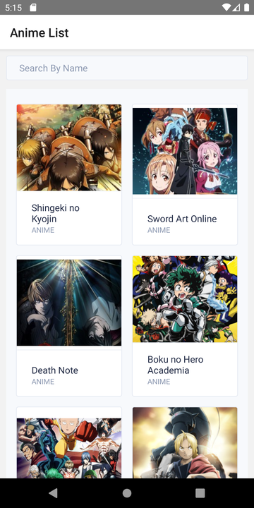
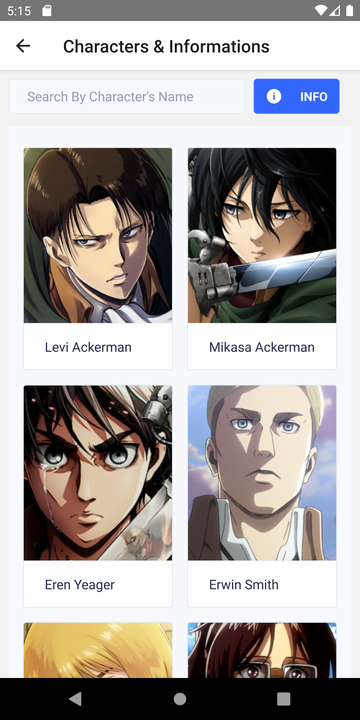

# anilist

A test project using the integration of react-native &amp; graphql with apolloclient

Run these command:
```
git clone https://github.com/muhdlaziem/anilist.git
npm i
react-native start
```
Open a new terminal and Run this command:
```
react-native run-android
```
---

## Screenshots

Main Screen



Characters & Information Screens



Information Alert


Search Result Anime


Search Result Character


